# Subgraph Plugin User Guide

## Design purpose, Why introduce new type of Plugin

we have already a Parser OP plugin, which would allow users to parse a unsupported op in their customer models.

But for most detection(segmentation) networks, the post-process is very variant, so it is HARD to support all post-process (and/or pre-process) in buildtool. 

In general, the post/pre-process is combined by several small ops. With the Parser OP plugin, the user need implement several plugin for support a single pre/post-process op, which is not friendly for user. It is not efficient and it may bring more potential risks since it make a simple problem to a complex problem.

Therefore, the Subgraph plugin is for resolving this issue.

## What is the Subgraph Plugin

The Subgraph Plugin is just can merge several op into one single op, it can make the graph more clear and make the supporting customized model easier.

The Subgraph Plugin has two mode:

* pattern based
* name based

The pattern based can be used to merge a pattern subgraph to a single op. This can be use if the pattern appears many time in your graph, you can just add a single plugin to support them.

The name based subgraph is just merge  the subgraph by the op names, it is easier to use but it usually is a mode specific plugin, it can not use for other model.

With the subgraph plugin, we can support all kind of post/pre-process.

## How to use it

The Subgraph Plugin is easy to use, the Subgraph Plugin shares same base class with Op Plugin, we just define some class member to identify  them. 

Below is the new base class:
```python
class ParserOp(object):
    # a string type of Op type
    op_type=None
    layout=None
    alias=None
    '''
    the named subgraph is define by start_nodes and end_nodes,
    the defined subgraph is combined by all nodes which in any of path from any of start_nodes to any of end_nodes.
    '''
    start_nodes=None
    end_nodes=None

    pattern_nodes=None
    pattern_edges=None

    def __init__(self,framework,op_infos):
        '''
    the framework is a string type, possible value is :
        * TensorFlow
        * TFLite
        * ONNX
        * Caffe


    if the plugin is a simple op plugin:
        The op_infos is a dict type to store all attributes,parameters in models'pb file.
        
    if the plugin is a Subgraph op, the op_infos is a dict. 
        if the plugin is a named subgraph op:
            the key is nodes'name, and value is a dict of all attributes in original model.
        if the plugin is a type-pattern subgraph:
            the key is integer from 0 to n that is the index of pattern, and value is a dict of all attributes in original model.
    '''
        # for hyper
        self.params=OrderedDict()
        # if 'name' in op_infos:
        #   self.params.update({'name': op_infos['name']})
        # for weights: str,numpy.array
        self.constants=OrderedDict()

    def infer_shape(self,input_tensors,*args):
        '''
        inference the output shape according to the input shape(s)
        return the output shape(s), a list of shape
        '''
        raise ParserOpNotImplement('Plugin Node (' + self.params.get('name', '') + ") infer_shape not implemented!")
    def nchw_to_nhwc(self):
        '''
        convert current layout to NHWC
        in this function, you need to change some parameters due to the layout conversion, for example:
        the permutes of transpose, axis of concat, etc.
        '''
        raise ParserOpNotImplement("")

    def multi_batch_transform(self, origin_batch_size, new_batch_size):
        raise ParserOpNotImplement("")
```

we add four class member:

* start_nodes
* end_nodes
* pattern_nodes
* pattern_edges

All the member is `None` by default. It some of them be set a not `None` value, the buildtool will check the value is consistent. These four members be separated into two groups: the `start_nodes` and `end_nodes` is for name based subgraph plugin, the `pattern_nodes` and `pattern_edges` is for the pattern based subgraph plugin. 

if you want to use name based subgraph plugin, the `start_nodes` and `end_nodes` must be set correctly, and the `pattern_ndoes` and `pattern_edges` must be `None`,  or vice versa.

### Name Based Subgraph Plugin

For the name based subgraph plugin, to define a subgraph, we use the op's name. So, we provide two class member: start/end_nodes. 

* start_nodes: is a list of string, to define the subgraph's start nodes.
* end_nodes: is a list of string to define the subgraph's end nodes.

for example, below is a graph,  we want to merge the green ops into one op, 



In this case, the start_nodes are all nodes which the parent is not in the subgraph: Conv0, Deconv0, MaxPool0. and the end_nodes is just the Concat0.

so, we can write a subgraph plugin as below:
```python
class MySubgraphPlugin(ParserOp):
    op_type=MySubgraphPlugin
    start_nodes=["Conv0","Deconv0","MaxPool0"]
    end_nodes=["Concat0"]

    def __init__(self,framework,op_infos):
        super().__init__(framework,op_infos)
        # the op infos is a dict
        conv0_infos=op_infos["Conv0"]
        deconv0_infos=op_infos["Deconv0"]
        maxpool0_infos=op_infos["MaxPool0"]
        concat0_infos=op_infos["Concat0"]
        # other code to deal with the ops info

    def infer_shape(self,input_tensors,*args):
        input0=input_tensors[0]
        input1=input_tensors[1]
        input2=input_tensors[2]
        # check the shape~
        shape=input0.shape
        # assume that the concat axis =3, which should be read in op_info
        shape+=input1.shape[3]+input2.shape[3]
        return np.random.randn(shape,dtype=XXX)
```
After applying the plugin, the graph would change to this:


So the AQT/OPT and GBuilder just need implement a plugin for the subgraph plugin.


### Pattern Based Subgraph Plugin

The pattern based subgraph need define a pattern: nodes and edges.

* pattern_nodes: a list of tuple of string: (nick_name,optype). it defines all nodes appear in the subgraph.  the nick name is for identifying the nodes, which is not relation with the op's name in graph. The optype name is the op's type.
* pattern_edges: is a list of tuple. the basic edge can be described of two op's name, also , you can add some attributes to determinate which input/output tensors of the edges. the attributes is a string dict as the third member of the tuple.

we current only support two attributes for edge:

* src_out_port: a unsigned int to indicate which the index of output for the source node, i.e. 0 means the first output of the source node, 2 means the third output etc. By default the value is 0.
* dst_in_port: a unsigned int to indicate which the index of input for the destination node, i.e. 0 means the first input of the destination node, 2 means the third input etc. By default the value is 0.

below is a simple example with the same case as before:
```python
class MySubgraphPlugin(ParserOp):
    op_type=MySubgraphPlugin
    pattern_nodes=[
        ('n0',"Conv"), # the n0 node is a Conv type
        ('n1',"Deconv"), # the n1 node is a Deconv type
        ('n2',"MaxPool"), # the n2 node is a MaxPool type
        ('n3',"Concat"), # the n3 node is a Concat type
    ]
    pattern_edges=[
        # the edge from n0 to n3, and the tensor is the first input of n3
        ('n0','n3', {'src_out_port': 0, 'dst_in_port': 0}),
       
        # the edge from n1 to n3, and the tensor is the second input of n3
        ('n1','n3', {'src_out_port': 0, 'dst_in_port': 1}),
       
        # the edge from n2 to n3, and the tensor is the third input of n3
        ('n2','n3', {'src_out_port': 0, 'dst_in_port': 2}),
    ]

    def __init__(self,framework,op_infos):
        super().__init__(framework,op_infos)
        # the op infos is a dict
        conv0_infos=op_infos["n0"]
        deconv0_infos=op_infos["n1"]
        maxpool0_infos=op_infos["n2"]
        concat0_infos=op_infos["n3"]
        # other code to deal with the ops info

    def infer_shape(self,input_tensors,*args):
        input0=input_tensors[0]
        input1=input_tensors[1]
        input2=input_tensors[2]
        # check the shape~
        shape=input0.shape
        # assume that the concat axis =3, which should be read in op_info
        shape+=input1.shape[3]+input2.shape[3]
        return np.random.randn(shape,dtype=XXX)
```