# Compass Unified Parser

Compass Unified Parser is designed for converting multi-framework models to a float Intermediate Representation (IR), which aligns with the standard IR definition of Arm China Zhouyi AIPU Neural Network (NN) compiler.


## Parser process flow and design philosophy
The main objective of the Parser is to convert a trained model to a float IR feeding to OPT(optimizer). Below is the process flow of the Parser.

1. A model will be fed in by an unified configuration file.
2. The entry point: Configuration reader will parse the config file, and dispatch the job to a supported reader.
3. One of supported readers will take over the input model. There are two steps for reading the model:
    * Parse the model file(for example, protobuf/flattenbuf/json or private format) and build a raw graph for the model
    * convert the raw graph nodes to unified nodes, for example:
        * Merge several TensorFlow nodes to one GRUSeq node
        * Convert caffe `detectionoutput` node to `detectbox` and `nms`
4. The reader will generate a unified graph, then pass to the front-end optimizer
5. The front-end optimizer will operate on the unified graph. It will merge or eliminate some nodes for OPT, for example:
    * Merge `conv` and `add` to one node
    * Merge `conv/fc` and `batchnorm`
    * Eliminate useless node: a `transpose` node with permutation in order

6. After optimization, do once shape inference, for getting all tensor shape.

7. Do some additional passes, for example:
    * Add post-process nodes for some models

8. Serialize to file.



### `Graph` and `Node` design

In this Parser, we use `Graph` and `Node` to represent models just like common framework. We use linked list type to represent the graph.

The `Graph` only keeps all nodes, and the topology info will be stored in `Node` by linking other `Node`.

`Node` represents the IR's layer, which can be serialized simply by `serialize` method.


### More about the design of the Parser

* The Parser only supports fixed shape graph i.e. static graph, and it will do multi times shape inference.
* After each graph operation, such as merge, convert, and eliminate, a shape inference is preferred, except you are sure that the shape is correct.
    * This is because any graph operation may change the topology of the graph, and the shape may be changed as well.
    * If some parameters can be only known after known shape, then put the parameters process in shape inference stage.
* Optimization passes only support unified graph, so put all framework dependent passes in the model reader part, because these passes can not be used for other frameworks.


## Quick Start

### Installation instructions

The Parser is a part of Compass AIPUBuilder(NN-Compiler). You can follow the instruments of Compass AIPUBuilder to install the AIPUBuilder. After installing the AIPUBuilder, the Parser is available.

Or you can build AIPUBuilder by yourself with [Compass_Integration](https://github.com/Arm-China/Compass_Integration). You can follow the guid in [Compass_Integration](https://github.com/Arm-China/Compass_Integration), then you will build a AIPUBuilder with the Parser. You can read the Zhouyi_Compass_Software_Programming_Guide_61010011_0205_01_en.pdf document in the [MiniPkg](https://aijishu.com/a/1060000000215443) for the usage.

Besides, the Parser can also run independently. Before running the `main.py`, please make sure the following requirements are met
### Requirements
* python (3.8 or higher)
* numpy
* onnx (> 12)
* protobuf
* flatbuffers
* tensorflow (== 2.6)
* torch

### Run the Parser

The Parser uses a config file(.ini) as input. You can directly run the `main.py` with your configure file as follows:
```bash
python3 main.py -c my_config.ini
```

### Config file format
All options are under the `Common` section:
* `input_shape` [__required__]

    The input shape(s) of model. Usually it is a single tensor shape, for example: `input_shape=[1,224,224,3]`

    If you have several inputs, please use comma the separate them, for example: `input_shape=[1,224,224,3],[1,112,112,3]`
* `model_name` [__required__]

    The name for the input model

* `model_type` [__optional__]

    The framework of the input model. By default is tensorflow. Currently it supports:
    * `tensorflow`
    * `tflite`
    * `onnx`
    * `caffe`

* `model_domain`  [__required__]

    The domain of the model, for example:
    * `image_classification`
    * `object_detection`
    * `keyword_spotting`
    * `speech_recognition`

* `detection_postprocess`  [__required__ when `model_domain` is  `object_detection`]

    If your model_domain is `object_detection`, and if you are using the official detection model, please specify your detection post process. Now it only supports two types of post process:

    * `caffe_fasterrcnn`
    * `ssd`
    * `ssd_resnet`
    * `yolo2`
    * `yolo3_tiny`
    * `yolo3_full`

* `input_model`  [__required__]

    File path of the input 3rd party model. Currently tensorflow frozen pb, tflite, caffe and onnx models are supported.

* `input`  [__required__]

    The input(s) node(s)' name of the model. If you have several inputs, use `,` to separate each one.

* `output`  [__required__]

    The output(s) node(s)' name of the model. If you have several outputs, use `,` to separate each one.

### Config sample
```ini
[Common]
input_shape = [1,224,224,3]
model_name = resnet50
model_domain = image_classification
detection_postprocess =
input_model = resnet50/frozen.pb
input = Placeholder
output = resnet_v1_50/predictions/Reshape
```

For more examples, please refer to [examples](examples).

### Run examples
First, you should download the model via download_model.sh in the model_framework folder in [examples](examples)
```bash
sh examples/tensorflow/download_model.sh
```

Then, config the input/output tensor information in example.cfg
```ini
[Common]
model_type = tensorflow
model_name = gru_l
model_domain = image_classification
input_model = ./GRU_L.pb
input = Mfcc:0
input_shape = [1, 49, 10]
output = labels_softmax:0
output_dir = ./
```

Run run_example.py
* `--framework` [__optional__]

    Specify the example to run, default is tensorflow.
* `--input_data` [__optional__]

    Specify the input data to feed, random data used if not present.

```bash
python3 run_example.py --framework [specify example] --input_data [specify feed data]
```

### [Contribution guide](doc/Contributing.md)